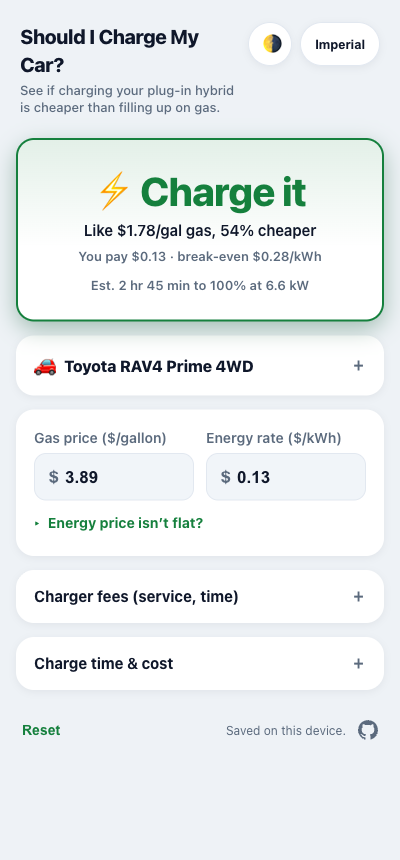
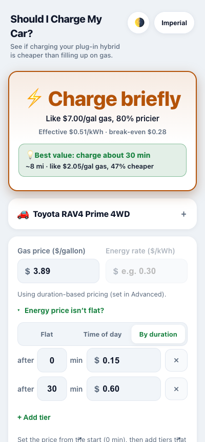

# Should I Charge My Car?

**[Try it live &rarr;](https://icloud17.github.io/should-I-charge-my-car/)**

A dead-simple calculator for **plug-in hybrid (PHEV)** owners that answers one question: **is charging actually cheaper than just burning gas right now?**

A PHEV runs on either electricity or gasoline, so every charge is a real choice, and public charging (or a pricey home rate) can easily cost more per mile than gas. Enter your car, the local gas price, and what the charger costs, and you get a clear verdict, the break-even price, and how much you save or overpay. Built to check on your phone while you're standing at the charger.

<p align="center">
  
  &nbsp;&nbsp;
  
</p>

## What it does

- Gives a clear verdict at a glance: **Charge it**, **Toss-up**, **Use gas**, or **Charge briefly**.
- Calculates the break-even charging price: the highest $/kWh at which charging still beats gas for your car.
- Puts it in plain terms, e.g. "like $1.78/gal gas, 54% cheaper."
- Estimates how long to charge to your target level, and the range you add.
- Handles real charger pricing: flat, time-of-day (peak/off-peak), or by-duration tiers, plus one-time session fees and per-hour connected-time fees.
- Finds the **sweet spot** when charging gets pricier the longer you go: how long to charge for the best deal, with a "Charge for" slider to price partial charges.
- Includes 441 plug-in hybrids from the US EPA (2012 to 2026), searchable, or enter your own numbers.
- Supports Imperial or metric units and any currency.
- Saves your car on your device and works offline (installable PWA).

## How it works

Charging is worth it when it costs less per mile than gas.

- Gas cost per mile = gas price / MPG
- Electric cost per mile = charger price / miles per kWh

Set them equal and you get the break-even charging price:

```
break-even $/kWh = gas price x (miles per kWh / MPG)
```

Below that, charging wins; above it, gas is cheaper. That is the whole idea. Everything else is just accounting for charger pricing schemes, which rarely keep it that simple.

## Run locally

No build step, no dependencies:

```sh
python3 -m http.server 8000
# open http://localhost:8000
```

## Tech

Vanilla HTML, CSS, and JavaScript (ES modules). No framework, no build, no backend. Installable offline PWA, hostable free on GitHub Pages.

Designed and built with [GitHub Copilot](https://github.com/features/copilot).

## Car data

MPG and electric-efficiency figures come from the US DOE/EPA at [fueleconomy.gov](https://www.fueleconomy.gov), the same source as window-sticker ratings. They are estimates, and every field is editable, so you can use your own numbers.

## Privacy

Your inputs stay on your device (`localStorage`); nothing you enter is sent anywhere. The hosted version uses [GoatCounter](https://www.goatcounter.com) for anonymous, cookieless analytics: page views plus a few categorical usage events (e.g. which verdict was shown, which pricing mode was used), never your actual numbers. No personal data, no cross-site tracking, and it never counts local dev.

## License

[GNU AGPL-3.0](LICENSE). Free to use, modify, and share; derivatives stay open under the same license, and a hosted modified version must offer its source to users.
